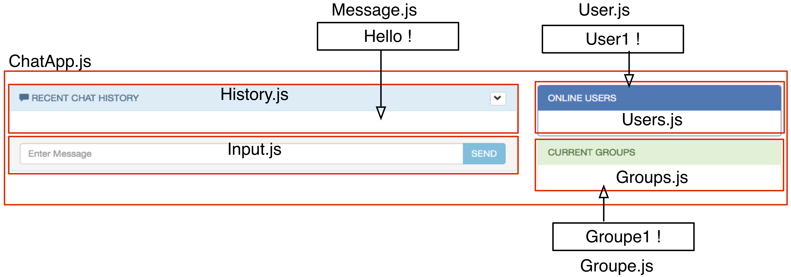

# Projet React

Le projet est constitué de deux parties. La partie client et la partie serveur. 

## PART I - Partie serveur 

Pour la partie serveur, vous devez reprendre le serveur que vous avez du développé *au premier semestre*. En particulier, vous devez reprendre la version *websocket*.  

> La version *websocket* est nécessaire car, cette fois-ci, votre client va fonctionner dans votre navigateur web. De fait, les échanges de messages vont être réalisés en HTTP. 

> On vous rappelle que pour la partie serveur vous devez utiliser la librairie
[socket.io](https://socket.io) (également pour la partie cliente au sein du navigateur)

> Cette fois-ci, seulement votre serveur est développé à partir de node.js. Le client lui va s'exécuter dans le navigateur web contrairement à votre projet du 1er semestre, et non plus en ligne de commande.

1. On vous rappelle le lien vers la documentation de socket.io (Voir la [documentation](https://socket.io/docs/) pour avoir plus de détails).

1. Dans votre projet, vous allez donc avoir deux répertoires. Un répertoire pour le côté client nommé `client`, qui sera développé en `React` à l'aide de la commande [create-react-app](https://create-react-app.dev), et un répertoire qui sera nommé `server` qui contiendra le code du serveur dont vous êtes déjà censé être en possession. 

> On vous rappelle que tous vos clients et serveurs doivent être interopérables. **Tous les messages échangés se feront en JSON et devront respecter la spécification donnée au 1er semestre sur les messages.**

## PART II - Partie client

La partie du client doit être développé en REACT. Veuillez trouver ci-joint une capture d'écran détaillant les différents composants de votre application. 



Chaque composant de votre application est un composant `React`. Et correspond ainsi à une classe `React` qui implémente spécifiquement une fonctionnalité spécifique de votre application. 

Au sein de chaque composant `react` vous devez avoir accès à la `websocket` qui vous relie au serveur afin de pouvoir réaliser les commandes correspondantes. 

Ainsi, dans le composant: 

- `History`, vous devez utiliser les requêtes/réponses JSON qui vous permettent d'avoir l'historique de la conversation mais aussi le ou les messages envoyés et/ou reçus. 

- `Message`, vous devez utiliser les requêtes/réponses JSON pour envoyer les messages. 

- `User`, idem pour avoir la liste des utilisateurs `online` et/ou `offline`

- `Group`, idem pour lister les groupes dont vous êtes membres. 

Par ailleurs, vous devez également avoir un peu d'imagination pour ajouter simplement, l'ajout des fonctions manquantes dans l'interface présentée, comme : 

- la gestion de groupe, on vous rappelle les fonctions supportées par votre serveur

|commande| Message  | Format du message | commentaires
| :------------| :------------ |:---------------:|:---------------:|
|cg;wob | create groupe     |       ``` {sender: sender_name, group: group_name ,action:'cgroupe'}```      |  `sender_name` crée le groupe `group_name`|
|j;wob | join     |       ``` {sender: sender_name, group: group_name ,action:'join'}```      |  `sender_name` joint le groupe `group_name`|
|bg;wob;`hello` | broadcast group     |       ``` {sender: sender_name ,group: group_name, msg: message_content ,action:'gbroadcast'}```      |  `sender_name` diffuse le message `message_content` au groupe `group_name`|
|members;wob| list   |       ``` {sender: sender_name ,group: 'group_name', action:'members'}```       |   `sender_name` liste les clients présents dans le groupe `group_name`
|messages;wob| list messages   |       ``` {sender: sender_name ,group: 'group_name', action:'msgs'}```       |   `sender_name` liste l'historique des messages du groupe `group_name`
|groups;| group list   |       ``` {name: sender_name ,action:'groups'}```       |   `sender_name` liste les groupes existants
|leave;wob| leave   |        ``` {sender: sender_name,group: 'group_name' ,action:'leave'}``` |    `sender_name` quitte le groupe `group_name`
|invite;[group];dest| invite   |        ``` {sender: sender_name , group: 'group_name', dest: receiver_name, action:'invite'}``` |    `sender_name` invite le user `receiver_name` dans le groupe `group_name`
|kick;[group];dest;reason| kick   |        ``` {sender: sender_name , group: 'group_name', dest: receiver_name, reason: 'reason', action:'kick'}``` |    `sender_name` exclut le user `receiver_name` dans du groupe `group_name` avec la raison `reason`|
|ban;[group];dest;reason| ban   |        ``` {sender: sender_name , group: 'group_name', dest: receiver_name, reason: 'reason', action:'ban'}``` |    `sender_name` exclut définitivement le user `receiver_name` du groupe `group_name` avec la raison `reason`|
|unban;[group];dest| unban   |        ``` {sender: sender_name , group: 'group_name', dest: receiver_name, action:'unban'}``` |    `sender_name` n'exclut plus définitivement le user `receiver_name` dans du groupe `group_name`|
|states;wob| list states   |       ``` {sender: sender_name , group: 'group_name', action:'states'}```       |   `sender_name` liste tous les évènements survenus dans le groupe `group_name`

 - l'envoie de messages privés ou multicast à l'aide des fonctions déjà supportées par votre serveur: 

|commande| Message  | Format du message | commentaires
| :------------| :------------ |:---------------:|:---------------:|
    |s;david;`hello` | send     |       ``` {sender: sender_name, dest: receiver_name ,msg: message_content ,action:'client-send'}```      |  `sender_name` envoie le message `message_content` à `receiver_name`

|command | message  | Json format | Comments
| :------------| :------------ |:---------------:|:---------------:|
|b;`hello` | broadcast     |       ``` {sender: sender_name ,msg: message_content ,action:'client-broadcast'}```      |  `sender_name` broadcasts the message `message_content` 

|Command | Message  | Json format | Commments|
| :------------| :------------ |:---------------:|:---------------:|
|ls;| list   |       ``` {sender: sender_name ,action:'client-list-clients'}```       |   `sender_name` lists the connected clients

|Command | Message  | Json format  | comments
| :------------| :------------ |:---------------:|:---------------:|
|q;| quit   |        ``` {sender: sender_name ,action:'client-quit'}``` | `sender_name` quit the serveré&